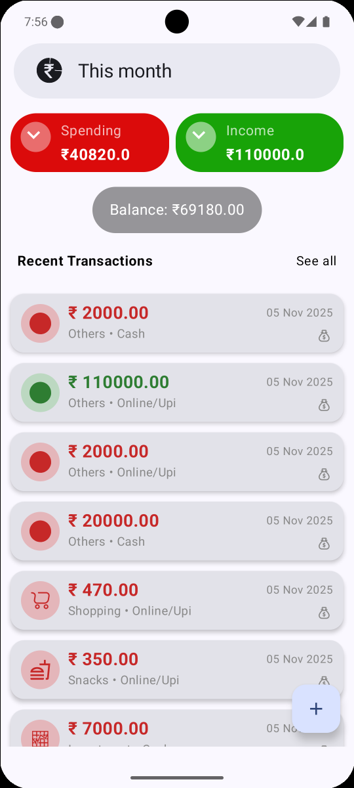
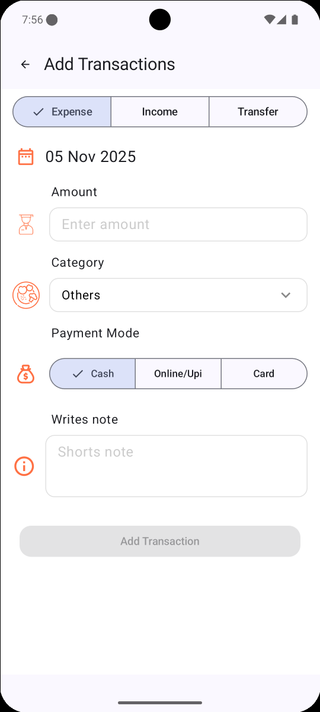
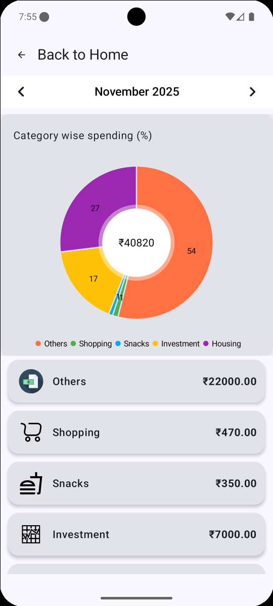
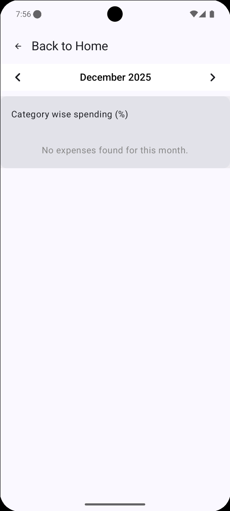
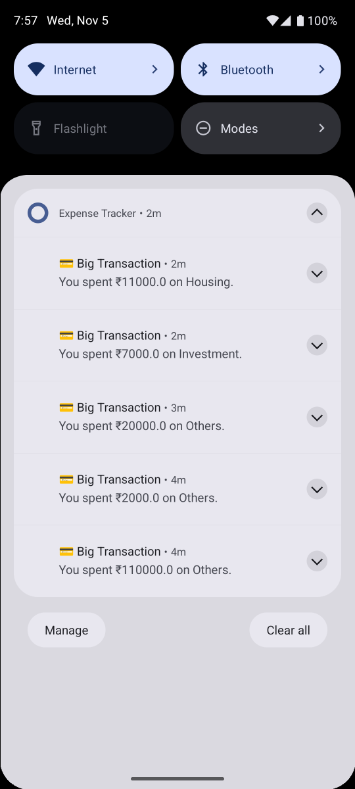

# 💰 Expense Tracker — Personal Finance Manager

A personal finance management Android application built entirely with **Jetpack Compose** and **Room Database**. It lets users record income, expenses, and transfers, visualize spending patterns through interactive charts, and stay on budget through smart local notifications.

---

## 📱 Overview

Managing day-to-day finances is often scattered across notes apps, bank SMS alerts, and memory. This app centralizes that into one offline-first tool — every transaction is stored locally, categorized, and summarized so the user always has an accurate picture of their financial health.

## 🖼️ Screenshots

| Home | Add Transaction | Analysis |
|------|------------------|----------|
|  |  |  |

| Empty State | Notification |
|-------------|--------------|
|  |  |

*(Replace the paths above with your own screenshots — see "Adding Screenshots" below)*

## 🚀 Key Features

- **Full transaction CRUD** — add, edit, and delete income, expense, and transfer entries
- **Category-wise breakdown** — pie chart visualization of spending by category using MPAndroidChart
- **Offline-first storage** — all data persisted locally via Room, no internet dependency
- **Smart budget alerts** via WorkManager background jobs:
  - Low balance warning (below a configurable threshold)
  - Monthly spending limit exceeded
  - Spending milestone notifications
  - Expense-exceeds-income warning
  - Daily reminder if no transaction was logged
- **Material 3 design system** with light/dark theme support
- **Reactive UI** — screen state updates instantly as data changes, no manual refresh needed

## 🧠 Architecture

This project follows **MVVM (Model–View–ViewModel)** with a repository layer, keeping data, business logic, and UI cleanly separated and independently testable.
